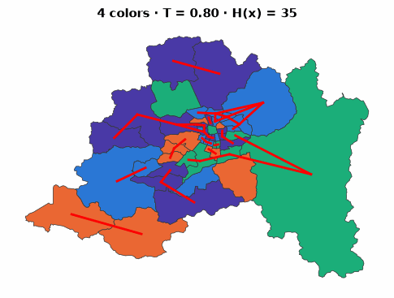
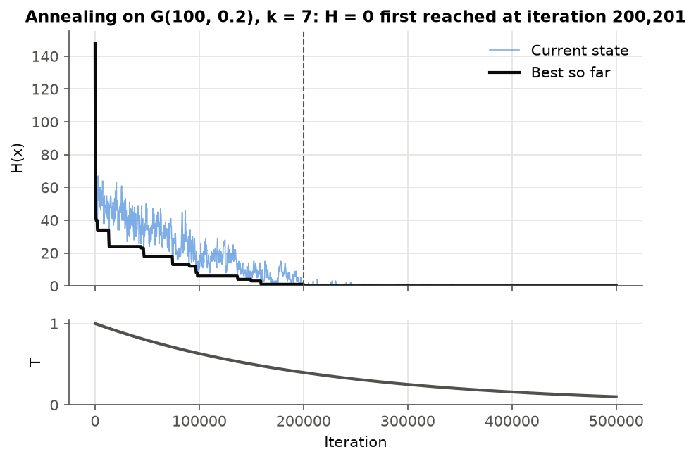
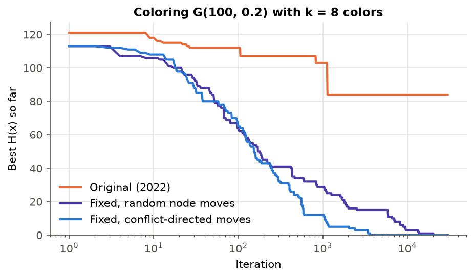
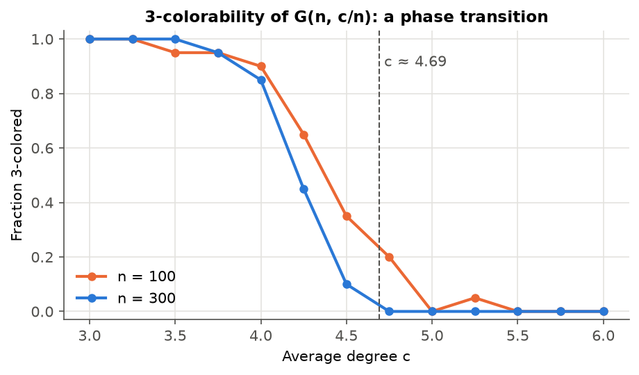
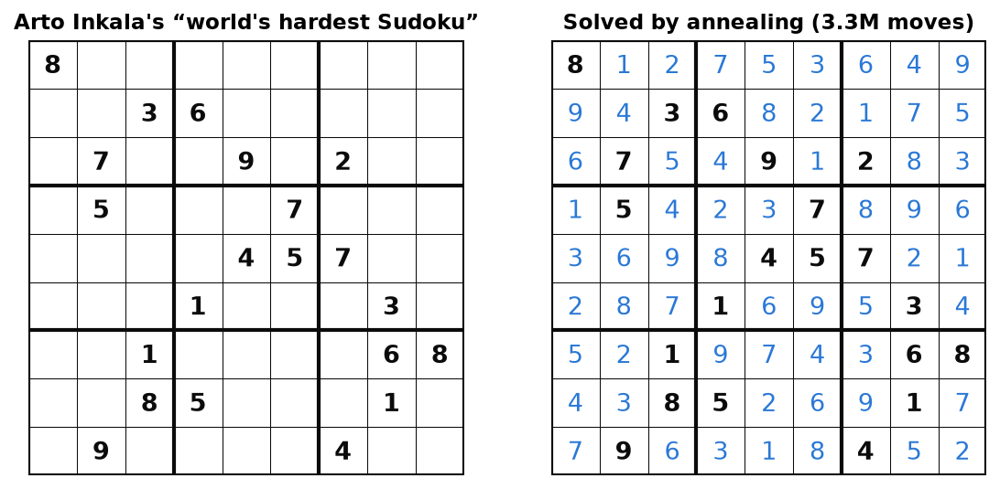
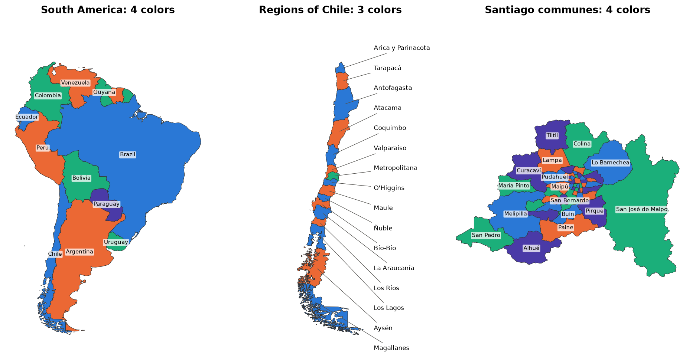
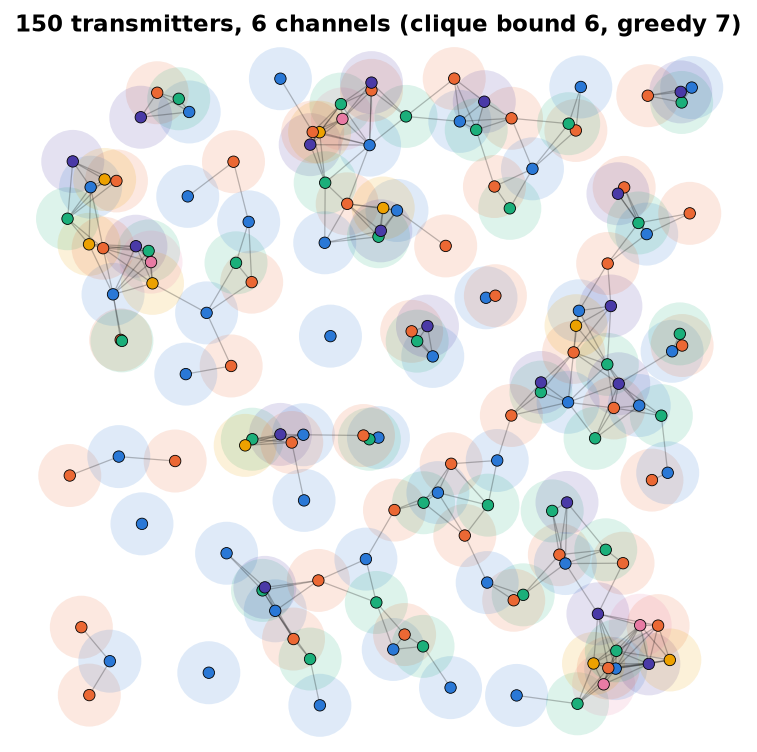
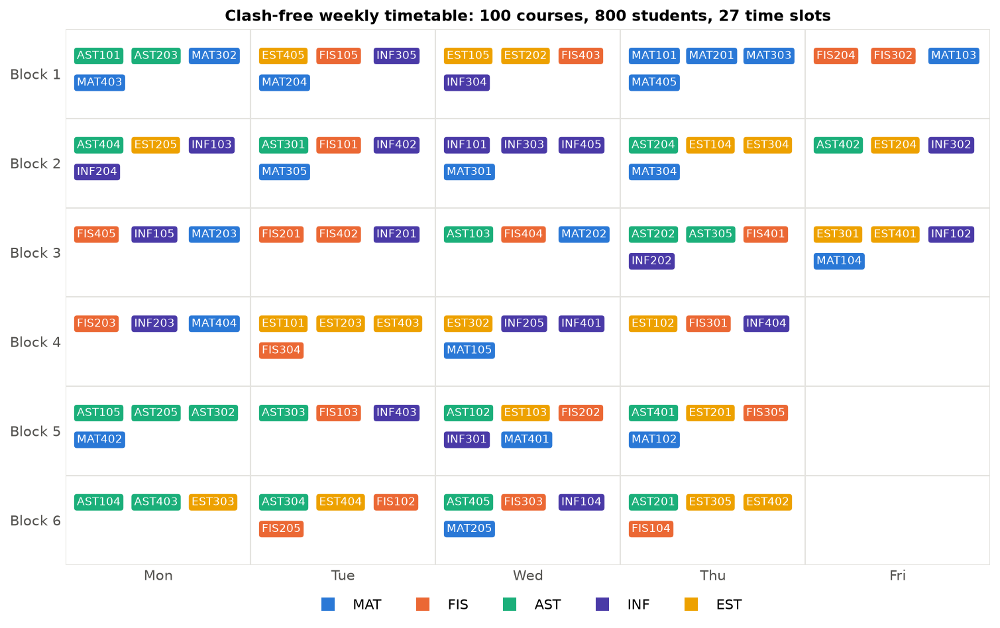

# Graph Coloring by Simulated Annealing

[](https://github.com/benjamitchell/Coloreo-de-Grafos/actions/workflows/ci.yml)


A small, tested Python library that colors graphs with **simulated annealing**,
compares it against classical heuristics and bounds on the chromatic number,
and applies it to **Sudoku**, **map coloring**, **radio frequency assignment**
and **timetabling**.

It started as a university project (the original notebook is kept in
[`legacy/`](legacy/)) and was rewritten from scratch: the bugs are fixed, the
cost is updated incrementally (~80× faster), and every claim below comes
from a script in this repository.

<p align="center">
  
</p>

## Try it live

**[Coloring by Cooling](https://benjamitchell.github.io/Coloreo-de-Grafos/)** runs the
same algorithms in your browser: watch annealing color the communes of Santiago (or
South America, Chile, the US, or any GeoJSON you upload) and solve any Sudoku you type
in, with the temperature and $H(x)$ updating live. Try $k = 3$ on Santiago to watch it
get stuck, exactly as the proof below predicts. The site lives in [`web/`](web/) and is
deployed by GitHub Actions; preview it locally with
`python scripts/build_web.py && python -m http.server -d _site`.

## The problem

Given a graph $G = (V, E)$ and $k$ colors, find $x : V \to \{1, \dots, k\}$
such that adjacent nodes get different colors. The smallest such $k$ is the
**chromatic number** $\chi(G)$, and computing it is NP-hard.

We turn it into an optimization problem by counting the edges whose
endpoints share a color:

$$
H(x) = \sum_{\{u, v\} \in E} \mathbf{1}[x_u = x_v],
$$

so $x$ is a proper coloring if and only if $H(x) = 0$. Simulated annealing
walks through colorings by recoloring one node at a time and accepts a move
$x \to x'$ with the Metropolis probability

$$
P(\text{accept}) = \min\left(1,\; e^{-(H(x') - H(x))/T}\right),
$$

while the temperature $T$ is lowered along a cooling schedule: at high $T$
the chain explores freely, and as $T \to 0$ it settles into low-cost states.

<p align="center"></p>

### Implementation notes

* **Incremental cost.** Recoloring $v$ only changes the edges at $v$, so
  $\Delta H$ costs $O(\deg v)$ instead of $O(|E|)$.
* **Conflict-directed moves.** The set of nodes currently in conflict is
  maintained in $O(1)$ per update, and moves are drawn from it
  (`move="conflict"`), in the spirit of min-conflicts. The textbook uniform
  choice is still available (`move="random"`).
* **Fixed nodes** (for Sudoku clues and pre-assigned timetable slots),
  several cooling schedules (constant, geometric, linear, logarithmic),
  reproducible seeds, and full cost/temperature histories.

## Before and after

The original 2022 notebook had three bugs in its annealing loop:

1. **The acceptance rule had the wrong sign.** It used
   $e^{-(H(x) - H(x'))/T}$, which is $> 1$ for every *worse* move, so every
   worse move was accepted and the "annealing" was a random walk.
2. **`C = len(color)`** used the number of *nodes* as the number of colors
   whenever a coloring was passed in, so the $n = 15$ experiment actually ran
   with 15 colors instead of 3.
3. **The temperature only decreased when a new best state was found**, so
   the schedule depended on luck instead of on time.

It also recomputed $H$ from scratch at every step, and one plot drew the
initial coloring under the title "final coloring".

<p align="center"></p>

On the same graph and number of iterations, the original stalls at
$H \approx 84$ while the fixed versions reach a proper 8-coloring.
Conflict-directed moves get there about 5× sooner than uniform ones in this
run, and 14× sooner (median over 10 seeds) with a 200,000-move budget.
Running 30,000 iterations takes 5.7 s with the original code and 0.07 s now.

## Chromatic number: bounds and benchmarks

`estimate_chromatic_number` traps $\chi(G)$ between a **lower bound**, the
clique number $\omega(G)$, and an **upper bound** that starts from DSATUR
and is then pushed down by annealing with $k - 1, k - 2, \dots$ colors until
it fails. Annealing can find colorings but never prove that none exists, so
when a gap remains an **exact backtracking search** (DSATUR branching with
forward checking) tries to show that $k - 1$ colors are impossible. When the
bounds meet, $\chi(G)$ is proven. Also included: greedy, Welsh–Powell,
smallest-last and DSATUR colorings, and the $\Delta + 1$, Brooks and
degeneracy bounds.

These DIMACS benchmark graphs are generated in code, so they need no
downloads, and their chromatic numbers are known:

| Graph | n | m | ω (clique) | Greedy | DSATUR | Annealing | Proof of χ | Known χ |
|---|---:|---:|---:|---:|---:|---:|:---:|---:|
| `myciel3` | 11 | 20 | 2 | 4 | 4 | **4** | exact search | 4 |
| `myciel4` | 23 | 71 | 2 | 5 | 5 | **5** | exact search | 5 |
| `myciel5` | 47 | 236 | 2 | 6 | 6 | **6** | no | 6 |
| `myciel6` | 95 | 755 | 2 | 7 | 7 | **7** | no | 7 |
| `queen5_5` | 25 | 160 | 5 | 8 | 5 | **5** | clique | 5 |
| `queen6_6` | 36 | 290 | 6 | 11 | 9 | **7** | exact search | 7 |
| `queen7_7` | 49 | 476 | 7 | 10 | 11 | **7** | clique | 7 |
| `queen8_8` | 64 | 728 | 8 | 13 | 12 | **9** | no | 9 |
| `queen8_12` | 96 | 1368 | 12 | 15 | 14 | **12** | clique | 12 |

Annealing reaches the known $\chi$ on every instance and beats DSATUR by up
to 4 colors on the queen graphs. The Mycielski graphs are triangle-free
($\omega = 2$) yet need up to 7 colors, a reminder that the clique bound
can be arbitrarily weak; the exact search closes that gap on the smaller
ones, while on the largest it runs out of budget and says so ("no").

### A phase transition

For sparse random graphs $G(n, c/n)$, 3-colorability undergoes a sharp
phase transition as the average degree $c$ crosses a threshold estimated
at $c \approx 4.69$ by the cavity method of statistical physics. Below it
almost every graph is 3-colorable; above it almost none is.

<p align="center"></p>

Each point is 20 random graphs with a budget of 200,000 moves. Annealing
can miss a coloring that exists, so these curves are *lower bounds* on the
true fraction, and the hardest instances cluster just below the threshold.
The drop still gets steeper as $n$ grows, which is what a phase transition
looks like at finite size.

## Applications

### Sudoku

A Sudoku is a 9-coloring of the **Sudoku graph**: 81 cells, with an edge
between any two cells in the same row, column or box (810 edges, 20
neighbours per cell). The clues are nodes with a fixed color.

<p align="center"></p>

Recoloring one cell at a time solves easy puzzles instantly but gets stuck
on hard ones. The solver therefore uses the neighbourhood of
[Lewis (2007)](https://doi.org/10.1007/s10732-007-9012-8): each box starts
as a permutation of its missing digits, and a move **swaps two free cells
of the same box**, only between digits that don't clash with a clue.
This is still graph coloring, restricted to colorings that are proper on
every box clique. It solves Inkala's "world's hardest Sudoku" in about
7 seconds (3.3M moves over 4 restarts). The optional constraint propagation
step (naked and hidden singles) solves easy puzzles on its own.

```python
from graph_coloring.apps import sudoku

result = sudoku.solve(sudoku.PUZZLES["hard"], seed=0)
print(sudoku.to_string(result.grid))
```

### Maps

Regions are nodes, and two regions are adjacent when they share a border of
positive length. Touching at a single point, as where four communes meet at
a corner, does not count. The **Four Color Theorem** guarantees that 4
colors always suffice. The borders are computed from official polygons
([Natural Earth](https://www.naturalearthdata.com) for countries and
regions, the [Biblioteca del Congreso Nacional](https://www.bcn.cl) for
communes) by [`scripts/build_map_data.py`](scripts/build_map_data.py).

<p align="center"></p>

* **South America needs 4 colors**: Argentina, Bolivia, Brazil and Paraguay
  all border each other (a $K_4$).
* **Chile's 16 regions need only 3**: the regions form a path, except for
  the triangle Valparaíso, Metropolitana, O'Higgins.
* **The 52 communes of the Santiago Metropolitan Region need 4**, and this
  is proven, not just observed. No four communes are mutually adjacent, but
  **Calera de Tango** is surrounded by the 5-cycle Maipú, Padre Hurtado,
  Peñaflor, Talagante, San Bernardo: its neighbours alone need 3 colors (an
  odd cycle), and it must differ from all of them. The exact search confirms
  that no 3-coloring exists.

The 48 contiguous **US states** are also included in the library (4 colors:
Nevada sits inside a 5-cycle, just like Calera de Tango).

### Radio frequency assignment

Transmitters closer than an interference radius must use different channels.
The interference graph is a **unit disk graph**, and the fewest channels
needed is its chromatic number.

<p align="center"></p>

Here annealing uses 6 channels, matching the clique lower bound, which
proves 6 is optimal. Greedy needs 7.

### Timetabling

Courses are nodes, and two courses conflict when they share a student or a
lecturer. A proper coloring is a **clash-free timetable** and the colors
are time slots. This is the classical formulation of exam timetabling
(Welsh & Powell, 1967; Carter, Laporte & Lee, 1996). The instance is
synthetic but shaped like a real faculty: 5 programs, 4 years, electives
across programs.

<p align="center"></p>

100 courses and 800 students fit in 27 of the 30 weekly blocks with no
clashes. DSATUR needs 28 and Welsh–Powell 29, and the clique bound shows at
least 26 are required.

## Usage

```bash
pip install -e ".[dev]"
```

```python
import networkx as nx
import graph_coloring as gc

G = nx.erdos_renyi_graph(100, 0.2, seed=1)

result = gc.simulated_annealing(G, k=7, n_iter=500_000, seed=0)
result.solved, result.solved_at        # (True, ...)
gc.is_proper(G, result.coloring)       # True

search = gc.estimate_chromatic_number(G, seed=0)
search.lower, search.upper             # proven lower bound and best k found

gc.chromatic_number(nx.petersen_graph())   # 3, by exact search

gc.simulated_annealing(G, 7, schedule=gc.Geometric(T0=1.0, alpha=0.99999))
```

The [tour notebook](notebooks/tour.ipynb) walks through everything above.

## Project layout

```
src/graph_coloring/
    cost.py          H(x), ΔH, properness checks
    annealing.py     simulated annealing with incremental updates
    schedules.py     cooling schedules
    classical.py     greedy, Welsh–Powell, smallest-last, DSATUR
    exact.py         exact k-colorability by backtracking
    chromatic.py     bounds on χ(G) and the annealing + exact search
    benchmarks.py    DIMACS queen and Mycielski graphs
    apps/            sudoku, maps (+ data), frequency, timetabling
scripts/             map data builder, figure generator
web/                 the interactive demo (plain HTML, CSS and JavaScript)
tests/               pytest suite (run in CI on Python 3.10–3.12)
legacy/              the original 2022 notebook
```

Regenerate every figure and the benchmark table with
`python scripts/make_figures.py` (a few minutes).

## References

* S. Kirkpatrick, C. D. Gelatt, M. P. Vecchi. *Optimization by simulated annealing*. Science, 1983.
* D. S. Johnson, C. R. Aragon, L. A. McGeoch, C. Schevon. *Optimization by simulated annealing: an experimental evaluation; part II, graph coloring and number partitioning*. Operations Research, 1991.
* D. Brélaz. *New methods to color the vertices of a graph*. Communications of the ACM, 1979.
* D. J. A. Welsh, M. B. Powell. *An upper bound for the chromatic number of a graph and its application to timetabling problems*. The Computer Journal, 1967.
* R. Lewis. *Metaheuristics can solve Sudoku puzzles*. Journal of Heuristics, 2007.
* R. Mulet, A. Pagnani, M. Weigt, R. Zecchina. *Coloring random graphs*. Physical Review Letters, 2002.
* M. W. Carter, G. Laporte, S. Y. Lee. *Examination timetabling: algorithmic strategies and applications*. JORS, 1996.
* K. Appel, W. Haken. *Every planar map is four colorable*. Bulletin of the AMS, 1976.
